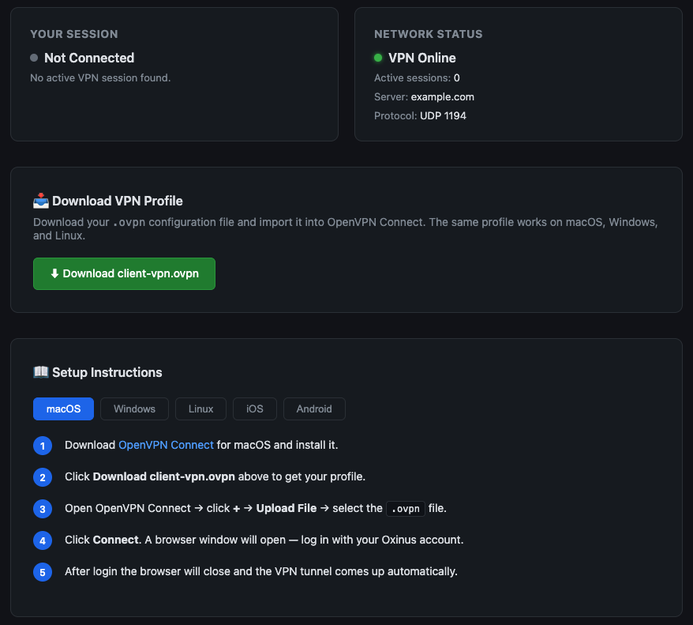

# OpenVPN Community Edition + Keycloak OIDC SSO

> **Production-tested guide** — OpenVPN CE with Keycloak OIDC authentication via `openvpn-auth-oauth2`.  
> No per-user certificates. Auth and authorisation fully delegated to Keycloak.  
> Users authenticate via browser redirect (WebAuth flow) — supports MFA, FIDO2, etc.
>
> **Optional Portal** — A [self-service portal](portal/README.md) lets users download `.ovpn` profiles, view setup instructions, and check active VPN session status. Runs on the same VM via FastAPI.
> 
---

## Architecture

```
Client (OpenVPN Connect)
    │
    │ UDP 1194 (tunnel)
    ▼
OpenVPN CE (server)
    │
    │ unix socket (/run/openvpn/server.sock)
    ▼
openvpn-auth-oauth2 (daemon)
    │
    │ OIDC
    ▼
Keycloak (id.ops.example.com/realms/myrealm)
```

**Nginx** sits in front on port 443 and proxies the OIDC callback to `openvpn-auth-oauth2` on port 9000.

---

## Prerequisites

| Requirement | Detail |
|---|---|
| OS | Debian 12 (Bookworm) |
| Keycloak | Running and accessible, realm + client pre-created |
| DNS | Domain pointing to the VPN server (e.g. `vpn.example.com`) |
| Firewall | Ports 80, 443 (TCP) and 1194 (UDP) open |
| Root access | Required throughout |

---

## Phase 1 — Install Packages

```bash
apt update && apt install -y openvpn easy-rsa nginx certbot python3-certbot-nginx iptables-persistent
```

---

## Phase 2 — PKI Setup (Server cert only)

```bash
make-cadir /etc/openvpn/easy-rsa
cd /etc/openvpn/easy-rsa
```

Create vars in the PKI directory (not the easy-rsa root — it causes conflicts):

```bash
./easyrsa init-pki

cat > /etc/openvpn/easy-rsa/pki/vars <<'EOF'
set_var EASYRSA_BATCH           "yes"
set_var EASYRSA_REQ_COUNTRY     "AE"
set_var EASYRSA_REQ_ORG         "YourOrg"
set_var EASYRSA_REQ_EMAIL       "ops@example.com"
set_var EASYRSA_REQ_OU          "VPN"
set_var EASYRSA_ALGO            "ec"
set_var EASYRSA_DIGEST          "sha512"
set_var EASYRSA_CA_EXPIRE       3650
set_var EASYRSA_CERT_EXPIRE     3650
EOF
```

> ⚠️ Do NOT set `EASYRSA_REQ_CN` in vars — it conflicts with `build-server-full`.

Build CA and server cert:

```bash
./easyrsa build-ca nopass
./easyrsa build-server-full server nopass
./easyrsa gen-dh
```

Generate TLS auth key:

```bash
mkdir -p /etc/openvpn/server
openvpn --genkey secret /etc/openvpn/server/ta.key
```

Copy certs to server directory:

```bash
cp /etc/openvpn/easy-rsa/pki/ca.crt \
   /etc/openvpn/easy-rsa/pki/issued/server.crt \
   /etc/openvpn/easy-rsa/pki/private/server.key \
   /etc/openvpn/easy-rsa/pki/dh.pem \
   /etc/openvpn/server/
```

---

## Phase 3 — Generate Shared Client Certificate

This is a **single shared cert** distributed to all users. It satisfies the TLS handshake. Actual identity and access control is handled entirely by Keycloak.

```bash
cd /etc/openvpn/easy-rsa
./easyrsa build-client-full client nopass
```

---

## Phase 4 — Install openvpn-auth-oauth2

Download the `.deb` package (check [latest release](https://github.com/jkroepke/openvpn-auth-oauth2/releases/latest)):

```bash
wget -O /tmp/openvpn-auth-oauth2.deb \
  https://github.com/jkroepke/openvpn-auth-oauth2/releases/download/v1.27.3/openvpn-auth-oauth2_1.27.3_linux_amd64.deb

dpkg -i /tmp/openvpn-auth-oauth2.deb
which openvpn-auth-oauth2   # should return /usr/bin/openvpn-auth-oauth2
```

---

## Phase 5 — Keycloak Client Configuration

In your Keycloak realm, configure the `openvpn` client:

| Setting | Value |
|---|---|
| Client Protocol | `openid-connect` |
| Access Type | `confidential` (Client authentication ON) |
| Valid Redirect URIs | `https://vpn.example.com/callback` |
| Web Origins | `https://vpn.example.com` |

Copy the **Client Secret** from the Credentials tab — needed in Phase 7.

---

## Phase 6 — OpenVPN Server Configuration

### Management password

```bash
echo "$(openssl rand -hex 16)" > /etc/openvpn/server/management-password.txt
chmod 600 /etc/openvpn/server/management-password.txt
```

### server.conf

```bash
cat > /etc/openvpn/server/server.conf <<'EOF'
port 1194
proto udp
dev tun

ca   /etc/openvpn/server/ca.crt
cert /etc/openvpn/server/server.crt
key  /etc/openvpn/server/server.key
tls-auth /etc/openvpn/server/ta.key 0
dh /etc/openvpn/server/dh.pem
topology subnet

cipher AES-256-GCM
auth SHA512
tls-version-min 1.2

server 10.8.0.0 255.255.255.0
push "redirect-gateway def1 bypass-dhcp"
push "dhcp-option DNS 8.8.8.8"
push "dhcp-option DNS 1.1.1.1"

keepalive 10 120
persist-key
persist-tun
user nobody
group nogroup

# OIDC auth — no per-user certs
verify-client-cert none
username-as-common-name
auth-user-pass-optional

# Management via unix socket (required for openvpn-auth-oauth2)
management /run/openvpn/server.sock unix /etc/openvpn/server/management-password.txt
management-client-auth

# Non-interactive session refresh token (8h = 28800s)
# Required for mobile clients and OpenVPN Connect v3
auth-gen-token 28800 external-auth

# Suppress UDP replay warnings (normal with UDP)
mute-replay-warnings

log-append  /var/log/openvpn/server.log
status      /var/log/openvpn/status.log
verb 3
EOF
```

Create log directory and socket directory:

```bash
mkdir -p /var/log/openvpn /run/openvpn
```

---

## Phase 7 — openvpn-auth-oauth2 Configuration

Generate secrets:

```bash
HTTP_SECRET=$(openssl rand -hex 8)       # 16 chars
REFRESH_SECRET=$(openssl rand -hex 8)    # 16 chars
MGMT_PASS=$(cat /etc/openvpn/server/management-password.txt)
```

Create the sysconfig env file:

```bash
mkdir -p /etc/sysconfig

cat > /etc/sysconfig/openvpn-auth-oauth2 <<EOF
CONFIG_HTTP_LISTEN=:9000
CONFIG_HTTP_BASEURL=https://vpn.example.com
CONFIG_HTTP_SECRET=${HTTP_SECRET}
CONFIG_OPENVPN_ADDR=unix:///run/openvpn/server.sock
CONFIG_OPENVPN_PASSWORD=${MGMT_PASS}
CONFIG_OAUTH2_ISSUER=https://id.ops.example.com/realms/myrealm
CONFIG_OAUTH2_CLIENT_ID=openvpn
CONFIG_OAUTH2_CLIENT_SECRET=<your-keycloak-client-secret>
CONFIG_OAUTH2_REFRESH_ENABLED=true
CONFIG_OAUTH2_REFRESH_EXPIRES=8h
CONFIG_OAUTH2_REFRESH_SECRET=${REFRESH_SECRET}
CONFIG_OAUTH2_REFRESH_USE__SESSION__ID=true
EOF

chmod 600 /etc/sysconfig/openvpn-auth-oauth2
```

> ⚠️ `CONFIG_HTTP_SECRET` and `CONFIG_OAUTH2_REFRESH_SECRET` must be exactly **16, 24, or 32 characters**.  
> `openssl rand -hex 8` produces exactly 16 hex chars. Do not use base64 — it produces variable length after stripping padding.

---

## Phase 8 — systemd Service for openvpn-auth-oauth2

```bash
cat > /etc/systemd/system/openvpn-auth-oauth2.service <<'EOF'
[Unit]
Description=OpenVPN OAuth2 Auth Daemon
Documentation=https://github.com/jkroepke/openvpn-auth-oauth2
Wants=network-online.target openvpn-server@server.service
After=network-online.target openvpn-server@server.service

[Service]
Restart=on-failure
RestartSec=5s
PrivateTmp=true
WorkingDirectory=/etc/openvpn
ExecStartPre=/bin/sleep 5
ExecStart=/usr/bin/openvpn-auth-oauth2
EnvironmentFile=/etc/sysconfig/openvpn-auth-oauth2
ProtectSystem=true
ProtectHome=true

[Install]
WantedBy=multi-user.target
EOF

systemctl daemon-reload
```

> The `ExecStartPre=/bin/sleep 5` gives OpenVPN time to bind the unix socket before the auth daemon connects.

---

## Phase 9 — IP Forwarding and NAT

Enable IP forwarding permanently:

```bash
echo 'net.ipv4.ip_forward=1' >> /etc/sysctl.conf
sysctl -p
```

Get your default network interface:

```bash
ip route | grep default | awk '{print $5}'
# e.g. ens4
```

Add NAT rule and persist it:

```bash
iptables -t nat -A POSTROUTING -s 10.8.0.0/24 -o ens4 -j MASQUERADE
netfilter-persistent save
```

Verify:

```bash
iptables -t nat -L POSTROUTING -n -v
cat /proc/sys/net/ipv4/ip_forward  # should return 1
```

---

## Phase 10 — Nginx + TLS

```bash
cat > /etc/nginx/sites-available/vpn.example.com <<'EOF'
server {
    listen 80;
    server_name vpn.example.com;
    return 301 https://$host$request_uri;
}

server {
    listen 443 ssl;
    server_name vpn.example.com;

    ssl_certificate     /etc/letsencrypt/live/vpn.example.com/fullchain.pem;
    ssl_certificate_key /etc/letsencrypt/live/vpn.example.com/privkey.pem;

    # Proxy OIDC callback to openvpn-auth-oauth2
    location / {
        proxy_pass http://127.0.0.1:9000;
        proxy_set_header Host $host;
        proxy_set_header X-Real-IP $remote_addr;
        proxy_set_header X-Forwarded-For $proxy_add_x_forwarded_for;
        proxy_set_header X-Forwarded-Proto $scheme;
    }
}
EOF

ln -s /etc/nginx/sites-available/vpn.example.com /etc/nginx/sites-enabled/
rm -f /etc/nginx/sites-enabled/default
```

Get TLS certificate via Certbot:

```bash
certbot --nginx -d vpn.example.com --non-interactive --agree-tos -m ops@example.com
nginx -t && systemctl reload nginx
```

---

## Phase 11 — Start Services

```bash
systemctl enable --now openvpn-server@server
sleep 6
systemctl enable --now openvpn-auth-oauth2
```

Verify both are running:

```bash
systemctl status openvpn-server@server
systemctl status openvpn-auth-oauth2
```

Expected auth daemon output:

```
level=INFO msg="discover oidc auto configuration..."
level=INFO msg="openvpn-auth-oauth2 started with base url https://vpn.example.com"
level=INFO msg="connection to OpenVPN management interface established"
level=INFO msg="OpenVPN Version: OpenVPN 2.6.x ..."
```

---

## Phase 12 — Generate Client Profile (.ovpn)

```bash
cat > /etc/openvpn/client.ovpn <<EOF
client
dev tun
proto udp
remote vpn.example.com 1194
resolv-retry infinite
nobind
persist-key
persist-tun

remote-cert-tls server
cipher AES-256-GCM
auth SHA512
key-direction 1

# Tell OpenVPN Connect to use WebAuth (OIDC browser flow)
setenv IV_SSO webauth

verb 3

<ca>
$(cat /etc/openvpn/server/ca.crt)
</ca>
<cert>
$(cat /etc/openvpn/easy-rsa/pki/issued/client.crt)
</cert>
<key>
$(cat /etc/openvpn/easy-rsa/pki/private/client.key)
</key>
<tls-auth>
$(cat /etc/openvpn/server/ta.key)
</tls-auth>
EOF
```

> The `<cert>` and `<key>` blocks are a **shared client certificate** — the same file is distributed to all users.  
> It is only used for TLS handshake. Identity and access control is handled by Keycloak.

---

## Client Installation

### macOS / Windows
1. Download [OpenVPN Connect v3](https://openvpn.net/client/)
2. Import the `client.ovpn` file
3. Connect — a browser window will open for Keycloak login
4. After login, the tunnel comes up automatically

### Linux
```bash
# Install OpenVPN 3 client
sudo apt install openvpn3
openvpn3 session-start --config client.ovpn
```

### Distribute the profile
```bash
# SCP to user's machine
scp /etc/openvpn/client.ovpn user@their-machine:~/vpn.ovpn
```

---

## Authentication Flow

```
1. User connects in OpenVPN Connect
2. OpenVPN server receives connection, notifies openvpn-auth-oauth2 via unix socket
3. openvpn-auth-oauth2 sends a WebAuth URL back to the client
4. OpenVPN Connect opens the URL in the default browser
5. Browser redirects to Keycloak login page
6. User authenticates (password, MFA, FIDO2, etc.)
7. Keycloak redirects back to https://vpn.example.com/callback
8. Nginx proxies callback to openvpn-auth-oauth2 on port 9000
9. openvpn-auth-oauth2 validates the token and sends client-auth to OpenVPN
10. Tunnel is established
```

---

## File Reference

| File | Purpose |
|---|---|
| `/etc/openvpn/server/server.conf` | OpenVPN server configuration |
| `/etc/openvpn/server/ca.crt` | Certificate Authority |
| `/etc/openvpn/server/server.crt` | Server certificate |
| `/etc/openvpn/server/server.key` | Server private key |
| `/etc/openvpn/server/ta.key` | TLS auth HMAC key |
| `/etc/openvpn/server/dh.pem` | Diffie-Hellman parameters |
| `/etc/openvpn/server/management-password.txt` | Unix socket password |
| `/etc/openvpn/easy-rsa/pki/issued/client.crt` | Shared client certificate |
| `/etc/openvpn/easy-rsa/pki/private/client.key` | Shared client private key |
| `/etc/openvpn/client.ovpn` | Client profile to distribute |
| `/etc/sysconfig/openvpn-auth-oauth2` | Auth daemon configuration |
| `/etc/systemd/system/openvpn-auth-oauth2.service` | Auth daemon systemd unit |
| `/var/log/openvpn/server.log` | OpenVPN server log |
| `/run/openvpn/server.sock` | Management unix socket |

---

## Troubleshooting

### Auth daemon fails to start — `oauth2.issuer is required`

The env var names use single underscore between sections and the binary reads them via `EnvironmentFile`. Run directly to debug:

```bash
export $(cat /etc/sysconfig/openvpn-auth-oauth2 | xargs) && /usr/bin/openvpn-auth-oauth2
```

### `http.secret requires a length of 16, 24 or 32`

Generate exact-length secrets:

```bash
openssl rand -hex 8    # = 16 chars  ✅
openssl rand -hex 12   # = 24 chars  ✅
openssl rand -hex 16   # = 32 chars  ✅
```

Do NOT use `openssl rand -base64` — it produces variable length after stripping `=` padding.

### OpenVPN server stuck at `Need hold release from management interface`

This is normal — `management-hold` makes OpenVPN wait for the auth daemon. If it never releases:

```bash
# Check if auth daemon connected
journalctl -u openvpn-auth-oauth2 -n 20 --no-pager

# If daemon crashed, remove management-hold from server.conf
# and add ExecStartPre=/bin/sleep 5 to the auth daemon service
```

### `AUTH_FAILED` immediately on connect

The `auth-user-pass-verify` directive was being used instead of management interface. Make sure server.conf does **NOT** have `auth-user-pass-verify`. The auth daemon communicates via the unix socket — no script needed.

### OpenVPN Connect asks for certificate

Add the shared client cert to the `.ovpn` profile (`<cert>` and `<key>` blocks) and add `setenv IV_SSO webauth`. OpenVPN Connect v3 requires a cert for TLS handshake even when using WebAuth.

### OpenVPN Connect stuck at `PUSH_REQUEST` / Connection Timeout

This is a known issue with OpenVPN Connect v3. Fix — add to `/etc/sysconfig/openvpn-auth-oauth2`:

```
CONFIG_OAUTH2_REFRESH_ENABLED=true
CONFIG_OAUTH2_REFRESH_EXPIRES=8h
CONFIG_OAUTH2_REFRESH_SECRET=<16-char-secret>
CONFIG_OAUTH2_REFRESH_USE__SESSION__ID=true
```

And add to `server.conf`:

```
auth-gen-token 28800 external-auth
```

### Internet not working through VPN

```bash
# Check NAT rule
iptables -t nat -L POSTROUTING -n -v

# Check IP forwarding
cat /proc/sys/net/ipv4/ip_forward

# Fix
sysctl -w net.ipv4.ip_forward=1
iptables -t nat -A POSTROUTING -s 10.8.0.0/24 -o ens4 -j MASQUERADE
netfilter-persistent save
```

### `AEAD Decrypt error: bad packet ID (may be a replay)`

Normal with UDP — packets arriving out of order. Not an error. Suppress with:

```
mute-replay-warnings
```

in `server.conf`.

### Check connected clients

```bash
cat /var/log/openvpn/status.log
```

### Tail logs

```bash
# OpenVPN server
tail -f /var/log/openvpn/server.log

# Auth daemon
journalctl -fu openvpn-auth-oauth2

# Both at once (two terminals)
tail -f /var/log/openvpn/server.log &
journalctl -fu openvpn-auth-oauth2
```

---

## Security Notes

- The management socket (`/run/openvpn/server.sock`) is protected by a password — never expose it to the network
- The shared client cert is for TLS only — it does not grant access. Revoke access via Keycloak
- Rotate `CONFIG_HTTP_SECRET` and `CONFIG_OAUTH2_REFRESH_SECRET` periodically — they encrypt session cookies and refresh tokens
- `verify-client-cert none` is intentional — Keycloak is the identity provider
- The Keycloak client secret in `/etc/sysconfig/openvpn-auth-oauth2` should be `chmod 600`

---

## References

- [openvpn-auth-oauth2 GitHub](https://github.com/jkroepke/openvpn-auth-oauth2)
- [openvpn-auth-oauth2 Wiki](https://github.com/jkroepke/openvpn-auth-oauth2/wiki)
- [OpenVPN Community Downloads](https://openvpn.net/community-downloads/)
- [Keycloak Documentation](https://www.keycloak.org/documentation)
